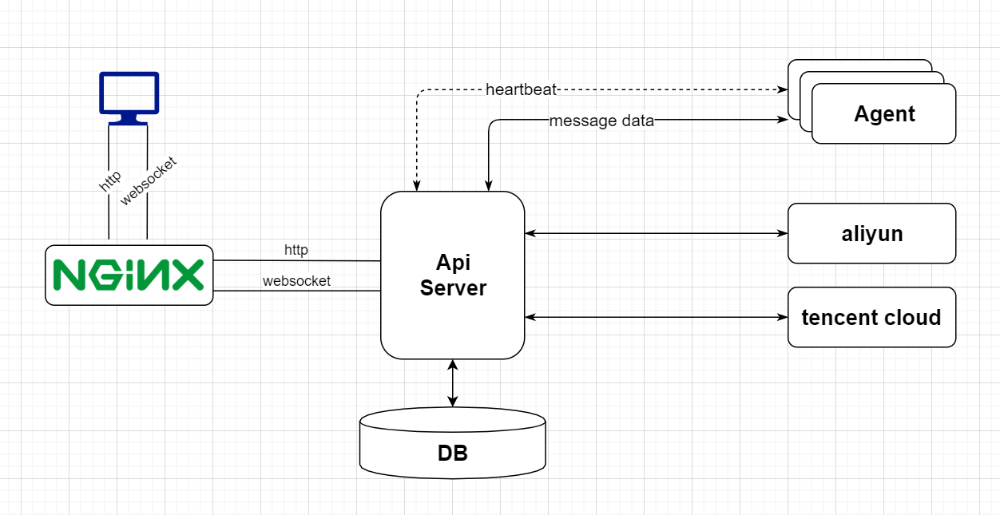

# gocmdb-front

## Description

You should deploy the backend first. Deploy backend go to `->` [gocmdb-backend](https://github.com/gogo-fast/gocmdb-backend)

After finished backend deployment, you could continue the following steps.


## Structure




## Build on `linux mint` manually

### Install nodejs

- Install nodejs

    ```shell script
    tar xf node-v12.18.2-linux-x64.tar.gz -C /data/env/
    cd /data/env
    ln -s ./node-v12.18.2-linux-x64 node
    ```

- Add PATH

    ```shell script
    sudo vi ~/.bash_profile
    or 
    # sudo vi ~/.bashrc
    # add the following config in .bash_profile or .bashrc
    # otherwise "umi: command not found" maybe accourt.
    export PATH="$PATH:/data/env/node/bin"
    ```

### Install umi and dependencies

- Make sure `g++` has been installed

    ```shell script
    # check g++ isntalled or not
    which g++
    # install g++ if not exist.
    sudo apt-get update
    sudo apt-get install build-essential g++
    ```

- Install `yarn` and `tyarn` [指南](https://v2.umijs.org/zh/guide/getting-started.html#%E7%8E%AF%E5%A2%83%E5%87%86%E5%A4%87)

    ```shell script
    npm i yarn tyarn -g
    ```

- Add umi

    ```shell script
    tyarn global add umi@2.0.0
    ```

- Clone Code

    ```shell script
    git clone git@github.com:gogo-fast/gocmdb-front.git
    ```

- Install dependencies

    ```shell script
    cd gocmdb-front
    tyarn install
    ```

- Add PATH

    ```shell script
    sudo vi ~/.bash_profile
    or 
    # sudo vi ~/.bashrc
    # add the following config in .bash_profile or .bashrc
    # otherwise "umi: command not found" maybe accourt.
    export PATH="$PATH:`yarn global bin`"
    ```

- Check umi

    ```shell script
    umi -v
    ```

### Start dev web server

- start server

    ```shell script
    tyarn start
    ```


### Access web browser


- Modify hosts on your pc:

    ```shell
    <web_server_ip>  go.cmdb.com
    ```


- `http://go.cmdb.com:8888`


## Quick start with docker

- Docker version

    ```shell
    $ docker -v
    Docker version 19.03.1, build 74b1e89
    ```

- Clone code

    ```shell
    git clone https://github.com/gogo-fast/gocmdb-front.git
    ```

- Build images

    ```shell
    cd gocmdb-front
    docker build --no-cache -t cmdb-fg:v0.1 .
    ```

- Run

    ```shell
    docker run --name cmdb_fg -d --link cmdb-api-server:go.cmdb.com -p 8888:8888 cmdb-fg:v0.1
    ```


## Screenshot


